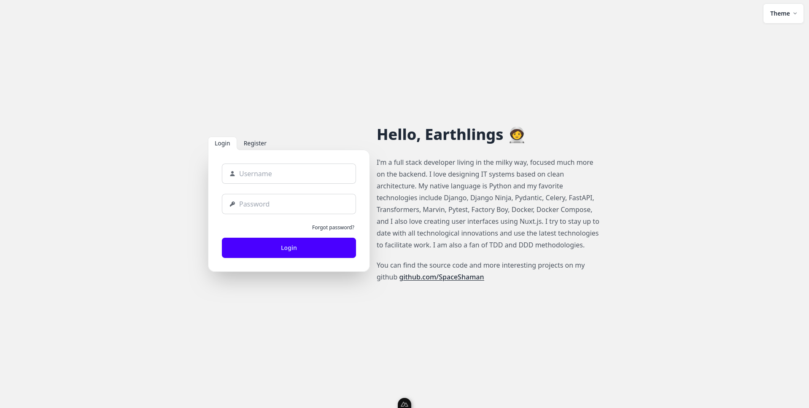
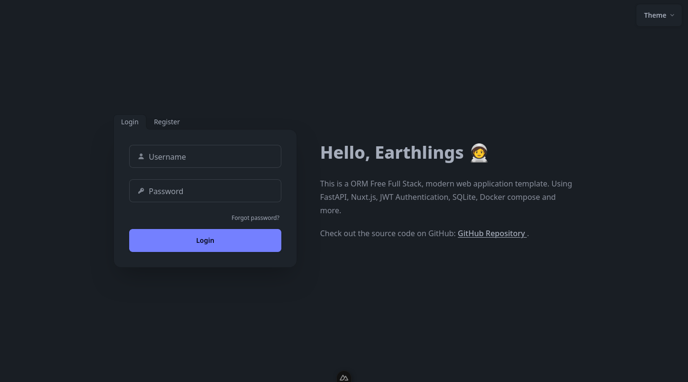
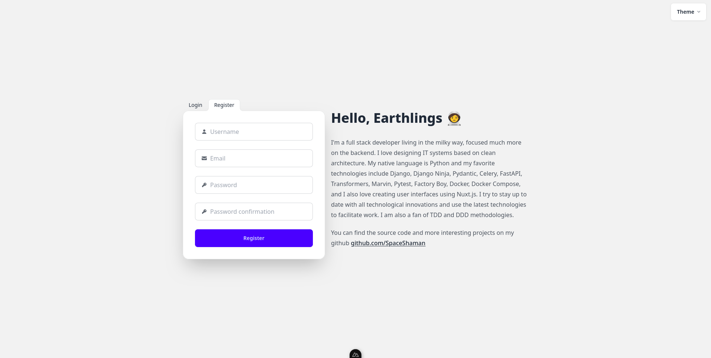
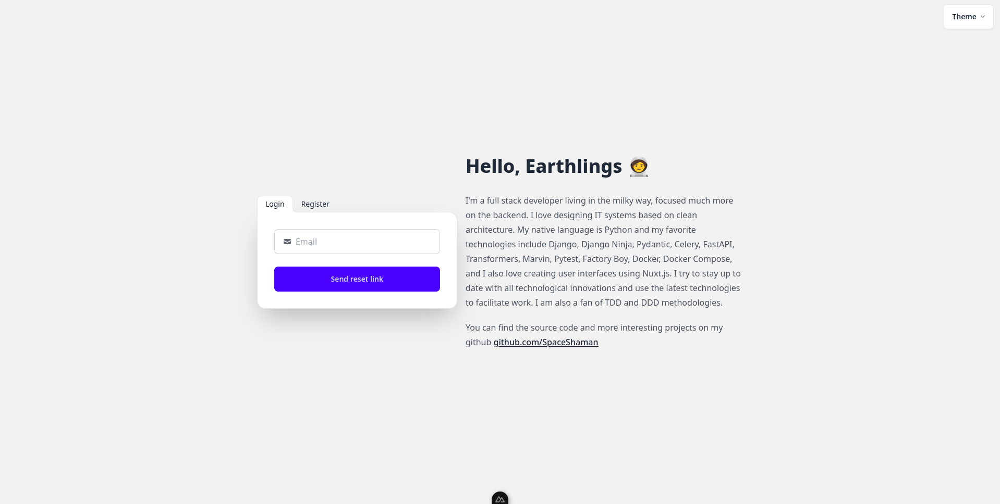
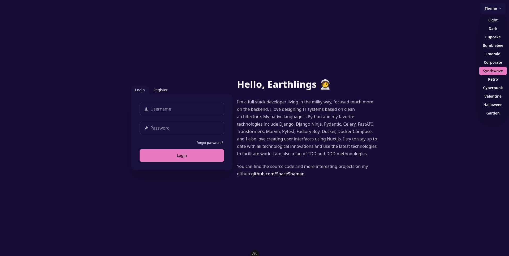
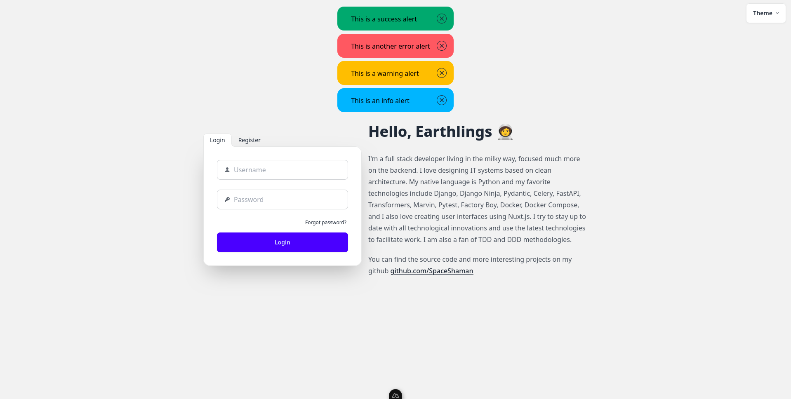
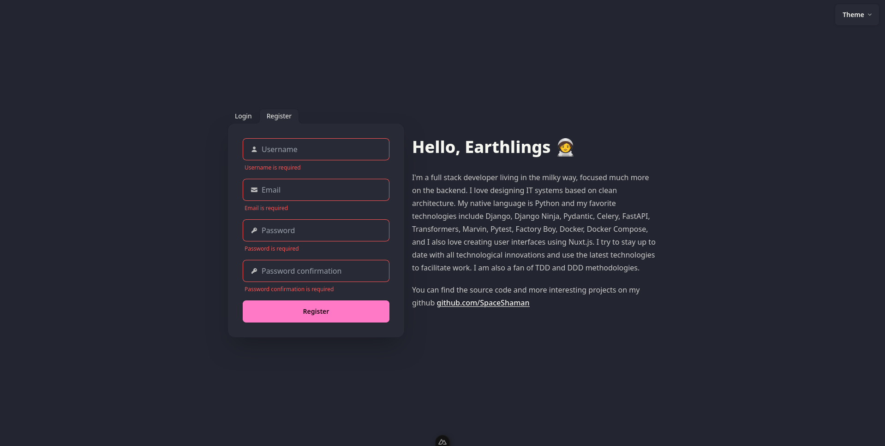
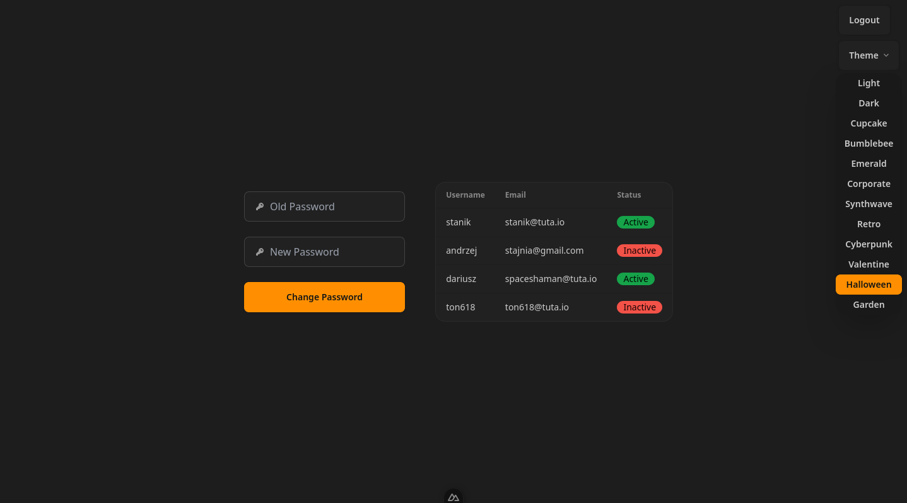
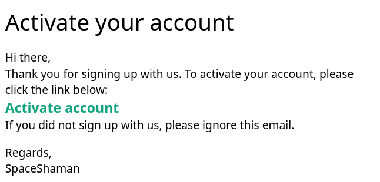

# Full Stack FastAPI Nuxt.js JWT Auth ORM Free Template

[](https://github.com/SpaceShaman/full-stack-fastapi-nuxt-jwt-auth-orm-free-template?tab=MIT-1-ov-file)
[](https://github.com/SpaceShaman/full-stack-fastapi-nuxt-jwt-auth-orm-free-template/blob/master/.github/workflows/tests.yml)
[](https://codecov.io/gh/SpaceShaman/full-stack-fastapi-nuxt-jwt-auth-orm-free-template)
[](https://www.python.org/)
[](https://www.typescriptlang.org/)
[](https://fastapi.tiangolo.com/)
[](https://nuxt.com/)
[](https://www.docker.com/)
[](https://docs.docker.com/compose/)
[](https://python-poetry.org)
[](https://docs.pydantic.dev)
[](https://tailwindcss.com/)
[](https://daisyui.com/)
[](https://vee-validate.logaretm.com)
[](https://yup-docs.vercel.app/)
[](https://jinja.palletsprojects.com/)
[](https://jwt.io/)
[](https://docs.pytest.org/)
[](https://www.sqlite.org/)
[](https://github.com/SpaceShaman/SQLift)
[](https://github.com/psf/black)
[](https://github.com/astral-sh/ruff)
[](https://prettier.io/)
[](https://eslint.org/)

## Technology Stack and Features

- ⚡ [**FastAPI**](https://fastapi.tiangolo.com) for the Python backend API.
    - 📦 [**Poetry**](https://python-poetry.org) for dependency management.
    - 🐶 [**Ruff**](https://github.com/astral-sh/ruff) for linting.
    - 📝 [**Pydantic**](https://docs.pydantic.dev) for data validation.
    - 🗃 [**SQLite**](https://www.sqlite.org) as database.
    - 🆓 **ORM Free**: Use raw SQL queries by leveraging the repository pattern.
    - 🛠 [**SQLift**](https://github.com/SpaceShaman/SQLift) for database migrations.
- 🚀 [**Nuxt.js**](https://nuxt.com) for the frontend.
    - 🟦 [**TypeScript**](https://www.typescriptlang.org) for static type checking.
    - 🖌 [**Prettier**](https://prettier.io) for code formatting.
    - ✨ [**ESLint**](https://eslint.org) for linting.
    - 🎨 [**TailwindCSS**](https://tailwindcss.com) for styling.
    - 🧩 [**daisyUI**](https://daisyui.com) for ready-to-use [**TailwindCSS**](https://tailwindcss.com) components.
    - 🔐 Middleware for authentication.
    - 📝 Form validation via [**VeeValidate**](https://vee-validate.logaretm.com) and [**Yup**](https://yup-docs.vercel.app/)
    - 🎨 Theme selector with 32 themes from [**daisyUI**](https://daisyui.com).
    - 🚨 Alerts and toasts via simple utility functions.
        - ❌ Call `showErrorAlert('message')` to show an error message.
        - ✅ Call `showSuccessAlert('message')` to show a success message.
        - 💡 Call `showInfoAlert('message')` to show an info message.
        - ⚠️ Call `showWarningAlert('message')` to show a warning message.
- 🔑 **JWT** (JSON Web Token) authentication.
- 📝 Registration with email based account activation.
- 🔒 Secure password hashing.
- 📫 Email based password recovery.
- 📧 SMTP email integration for sending emails.
- ✉️ Jinja templates for email messages.
- ✅ Tests with [Pytest](https://pytest.org).
- 🚢 Deployment instructions using Docker Compose.
- 🔄 **CI/CD** with GitHub Actions
    - 🧪 Automated testing before deployment
    - 📊 Code coverage reporting with Codecov
    - 🚀 Continuous integration and deployment pipeline
    - 📦 Ready-to-use workflow configurations in `.github/workflows/`

### Login Page




### Register Page



### Password Recovery



### Theme Selector



### Alerts and Toasts



### Validation



### Simple Dashboard



### Activation Email



## How To Use It

You can **just fork or clone** this repository and use it as is.

✨ It just works. ✨

### Configure

You need to configure the environment variables to set your own values.
You can copy the example `.env` files:

```bash
cp .env.default .env
```

And then edit the `.env` file and set your own values.

### Run

#### Run in development environment

```bash
docker-compose -f docker-compose.dev.yml up
```

#### Run in production environment

```bash
docker-compose up
```

### CI/CD

This project has a CI/CD pipeline with GitHub Actions.
You can see the workflow configuration in [.github/workflows/](.github/workflows/).
To use it, you need to set the following secrets in your repository settings:

```bash
CODECOV_TOKEN   # Your Codecov token
HOST            # Your SSH host
SSH_KEY         # Your SSH private key
USERNAME        # Your SSH username
```

### Comunication between FastAPI and Nuxt.js

The communication between FastAPI and Nuxt.js is done via plugin `api' which is located in [frontend/plugins/api.ts](frontend/plugins/api.ts).
This plugin uses the [$fetch](https://nuxt.com/docs/getting-started/data-fetching) to make requests to the FastAPI backend.
You can use this plugin in two ways:

#### Like useFetch

```typescript
const { data: users } = await useAPI<User[]>('/users', {
    method: 'get',
    ...
})
```

#### Like $fetch

```typescript
await useNuxtApp().$api<{ token: string }>('/auth/login', {
    method: 'POST',
    ...
})
```

## License

This project is licensed under the terms of the [MIT license](/LICENSE).
