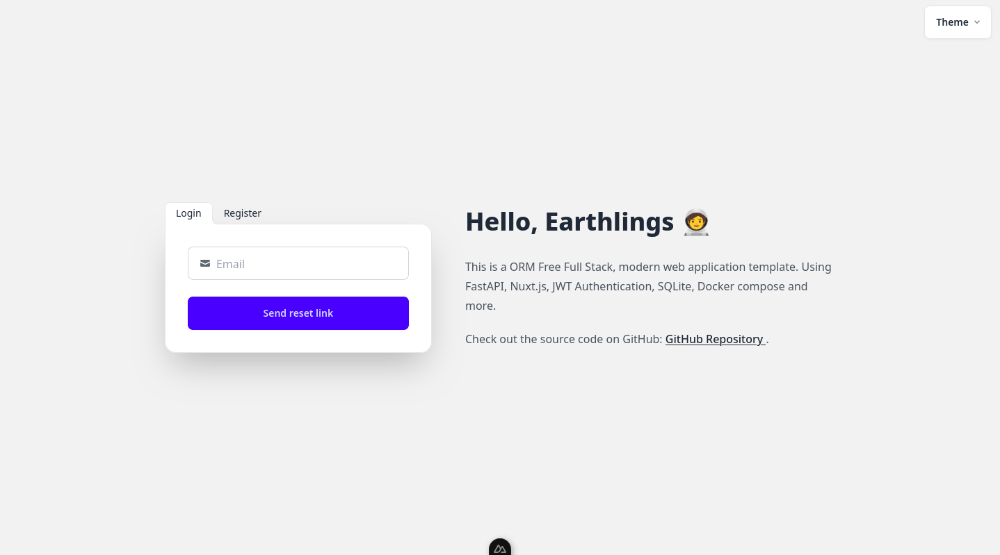
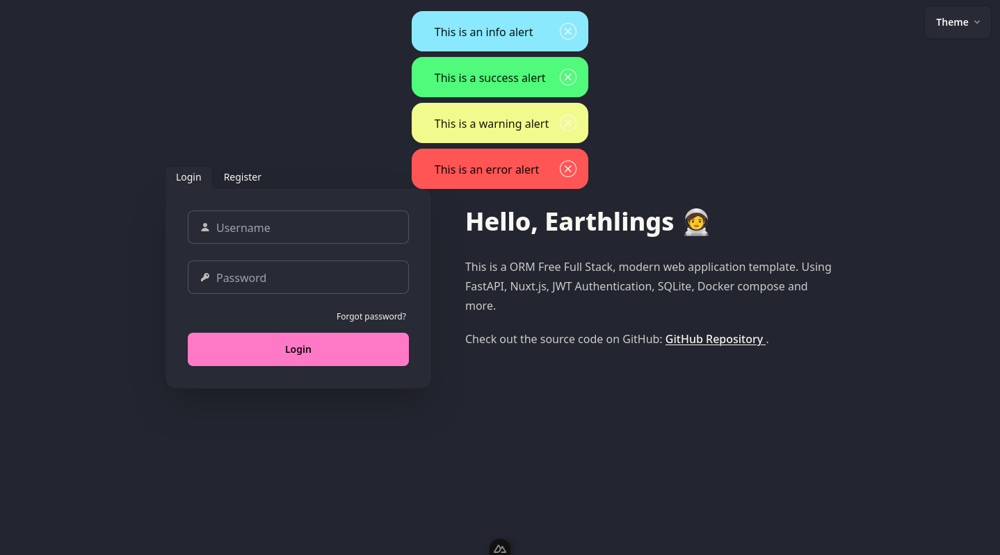

# Full Stack FastAPI Nuxt.js JWT Auth ORM Free Template

[](https://github.com/SpaceShaman/full-stack-fastapi-nuxt-jwt-auth-orm-free-template?tab=MIT-1-ov-file)
[](https://github.com/SpaceShaman/full-stack-fastapi-nuxt-jwt-auth-orm-free-template/blob/master/.github/workflows/tests.yml)
[](https://codecov.io/gh/SpaceShaman/full-stack-fastapi-nuxt-jwt-auth-orm-free-template)
[](https://www.python.org/)
[](https://www.typescriptlang.org/)
[](https://fastapi.tiangolo.com/)
[](https://nuxt.com/)
[](https://www.docker.com/)
[](https://docs.docker.com/compose/)
[](https://python-poetry.org)
[](https://docs.pydantic.dev)
[](https://tailwindcss.com/)
[](https://daisyui.com/)
[](https://vee-validate.logaretm.com)
[](https://yup-docs.vercel.app/)
[](https://jinja.palletsprojects.com/)
[](https://jwt.io/)
[](https://docs.pytest.org/)
[](https://www.sqlite.org/)
[](https://github.com/SpaceShaman/SQLift)
[](https://github.com/psf/black)
[](https://github.com/astral-sh/ruff)
[](https://prettier.io/)
[](https://eslint.org/)

## Technology Stack and Features

### Backend

- ⚡ [**FastAPI**](https://fastapi.tiangolo.com) as the backend framework.
- 📦 Dependency management with [**Poetry**](https://python-poetry.org).
- 🐶 Code linting using [**Ruff**](https://github.com/astral-sh/ruff).
- 📝 Data validation with [**Pydantic**](https://docs.pydantic.dev).
- 🗃 [**SQLite**](https://www.sqlite.org) as the database.
- 🆓 **ORM free** approach using raw SQL queries with the repository pattern.
- 🛠 Database migrations with [**SQLift**](https://github.com/SpaceShaman/SQLift).
- 🔑 **JWT** (JSON Web Token) authentication.
- 📝 Registration with email based account activation.
- 🔒 Secure password hashing.
- 📫 Password recovery via email.
- 📧 SMTP integration for sending emails.
- ✉️ Email templates using Jinja.
- ✅ Unit testing with [**Pytest**](https://pytest.org).

### Frontend

- 🚀 [**Nuxt.js**](https://nuxt.com) as the frontend framework.
- 🟦 [**TypeScript**](https://www.typescriptlang.org) for static type checking.
- 🖌 Code formatting with [**Prettier**](https://prettier.io).
- ✨ Code linting using [**ESLint**](https://eslint.org).
- 🎨 Styling with [**TailwindCSS**](https://tailwindcss.com).
- 🧩 Ready-to-use components from [**daisyUI**](https://daisyui.com).
- 🔐 Middleware for authentication handling.
- 📝 Form validation with [**VeeValidate**](https://vee-validate.logaretm.com) and [**Yup**](https://yup-docs.vercel.app/).
- 🎨 Theme selector with 32 themes from [**daisyUI**](https://daisyui.com).
- 🚨 Utility functions for alerts and notifications.
    - ❌ Call `showErrorAlert('message')` to show an error message.
    - ✅ Call `showSuccessAlert('message')` to show a success message.
    - 💡 Call `showInfoAlert('message')` to show an info message.
    - ⚠️ Call `showWarningAlert('message')` to show a warning message.

### CI/CD

- 🔄 CI/CD pipeline with GitHub Actions.
- 🧪 Automated testing before deployment.
- 📊 Code coverage reporting with [**Codecov**](https://about.codecov.io)
- 🚀 Ready-to-use workflow configurations in [.github/workflows/](.github/workflows/)

### Deployment

- 🚢 Deployment instructions using [**Docker Compose**](https://docs.docker.com/compose).
- 🚦 [**Traefik**](https://doc.traefik.io/traefik) as a reverse proxy.

## Screenshots

### Login Page


### Register Page


### Password Recovery



### Theme Selector


### Alerts and Toasts



### Validation


### Simple Dashboard


### Activation Email


## How To Use It

You can **just fork or clone** this repository and use it as is.

✨ It just works. ✨

### Configure

You need to configure the environment variables to set your own values.
You can copy the example `.env` files:

```bash
cp .env.default .env
```

And then edit the `.env` file and set your own values.

### Run

#### Run in development environment

```bash
docker-compose -f docker-compose.dev.yml up
```

#### Run in production environment

```bash
docker-compose up
```

### CI/CD configuration

This project has a CI/CD pipeline with GitHub Actions.
You can see the workflow configuration in [.github/workflows/](.github/workflows/).
To use it, you need to set the following secrets in your repository settings:

```bash
CODECOV_TOKEN   # Your Codecov token
HOST            # Your SSH host
SSH_KEY         # Your SSH private key
USERNAME        # Your SSH username
```

### Comunication between FastAPI and Nuxt.js

The communication between FastAPI and Nuxt.js is done via plugin `api' which is located in [frontend/plugins/api.ts](frontend/plugins/api.ts).
This plugin uses the [$fetch](https://nuxt.com/docs/getting-started/data-fetching) to make requests to the FastAPI backend.
You can use this plugin in two ways:

#### Like useFetch

```typescript
const { data: users } = await useAPI<User[]>('/users', {
    method: 'get',
    ...
})
```

#### Like $fetch

```typescript
await useNuxtApp().$api<{ token: string }>('/auth/login', {
    method: 'POST',
    ...
})
```

## License

This project is licensed under the terms of the [MIT license](/LICENSE).
